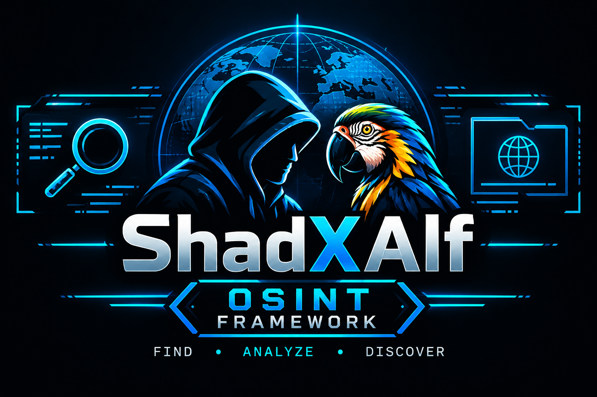

# ShadXAlf

ShadXAlf is a terminal-based OSINT framework for defensive and legal reconnaissance. The project is currently in active development and provides working domain-analysis tools together with menu placeholders for planned modules.



## Current Status

### Working
> Tested but might be prone to bugs.

- Terminal-based main menu
- Domain search menu
- Host discovery using DNS resolution
- IPv4 and IPv6 address lookup
- Optional reverse DNS lookup
- URL checker with basic phishing indicators
- Limited HTML inspection for defensive analysis
- Redirect and HTTP status reporting
- Certificate Transparency subdomain enumeration through `crt.name`
- Credits screen

### In Progress

- Username searcher
- Email searcher
- Phone number searcher
- IP tracker
- Social media searcher
- URL checker improvements and broader detection rules
- More reliable error handling and result presentation
- Automated tests and documentation

### Planned Additions
> Plans are not guaranteed additions.  
- DNS Digger
- Google Dorking
- Leaked Databreach Search
- Scripting
- Configurations
- Mac Addresses Lookup
- GPS To Decimal Converter
- Dark Web Searching


## Features

### Host Discovery

Resolves a hostname or IP address and displays available addresses. When possible, the tool also attempts a reverse DNS lookup.

### URL Checker

The URL checker performs a limited, defensive inspection of a web page. It checks items such as:

- HTTPS usage
- IP addresses used as hosts
- Punycode hostnames
- Unusually long URLs
- Many query parameters
- Redirects to another host
- Password fields and HTML forms
- Forms submitting to another host
- Common urgent account-related wording

The result is an indicator-based assessment, not a guarantee that a website is safe or malicious. The checker does not submit forms or enter credentials.

### Subdomain Enumeration

The subdomain tool queries passive Certificate Transparency data through:

```text
https://crt.name/v1/search?apex={domain}
```

Certificate names are cleaned, filtered to the requested domain, deduplicated, and displayed. This is passive enumeration and does not actively scan hosts.

## Requirements

- Python 3.10 or newer
- Internet access for DNS, URL, and Certificate Transparency lookups
- No third-party Python packages are currently required

## Usage

Run the main menu from the project root:

```powershell
python main_men.py
```
## Project Structure

```text
ShadXAlf/
├── README.md
├── SOURCE/
│   ├── main_men.py
│   ├── DATA/
│   ├── MODULES/
│   │   ├── CATEGORIES/
│   │   │   └── Domain_search/
│   │   │       └── domain_methods.py
│   │   └── CREDITS/
│   │       └── show_credits.py
│   └── UPLOADS_FOR_README/
└── Dark_site/
```

## Menu Info
The main menu currently contains these regular options:

```text
[1] Username Searcher
[2] Email Searcher
[3] Phone Number Searcher
[4] IP Tracker
[5] Domain Searcher
[6] Social Media Searcher
[99] Exit
[999] Credits
```

Inside the Domain Searcher:

```text
[01] Host Discovery
[02] URL checker
[03] Subdomain enumeration
```

Enter `q` in the domain tools to return to the main menu.


> [!IMPORTANT]\
> Legal Notice

ShadXAlf is intended for lawful security research, OSINT, education, and analysis of systems you own or are authorized to inspect. Always respect applicable laws, terms of service, privacy requirements, and the permissions of system owners.

The authors are not responsible for misuse of this project.
